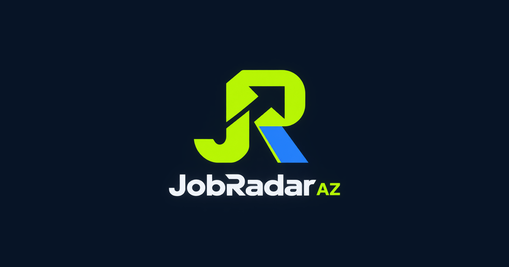

# JobRadar AZ — public website

[Live site](https://jobradaraz.com) · Azerbaijani and Russian

JobRadar AZ helps people in Azerbaijan discover vacancies from multiple job boards and Telegram groups in one place. Visitors can browse by category, open vacancy detail pages and follow links to the original listings.

## What this repository contains

This repository holds the **published static website**: generated HTML pages, CSS, JavaScript, images, a blog, sitemap and PWA assets. The ru/ directory contains Russian-language pages; vakansiya/ contains vacancy detail pages. The site is served through GitHub Pages with the custom domain above.

The collection, filtering, notification and publishing bot is maintained in a **separate private repository**. Its source code and deployment credentials are not included here. New site files are generated and published by that pipeline; the commit history shows recurring site refreshes. This distinction matters when reviewing the project: the public repository demonstrates the delivered website, while the full ingestion system is private.

## How it works

1. The private pipeline collects vacancy information from supported sources and filters irrelevant entries.
2. It generates Azerbaijani and Russian pages and publishes the static output here.
3. Users browse the site and visit the original vacancy source to apply. The related Telegram bot can send alerts matched to users' interests.

This is an actively developed project. The live site is the best place to check the current content and user experience.

## Explore locally

Because this repository is the generated site, no build step is required for a basic preview. Run python3 -m http.server 8000, then open http://localhost:8000. Some links and site features may expect the production domain.

## Project links

- [Live website](https://jobradaraz.com)
- [GitHub profile and other AI projects](https://github.com/nabiyevsamir-002)
